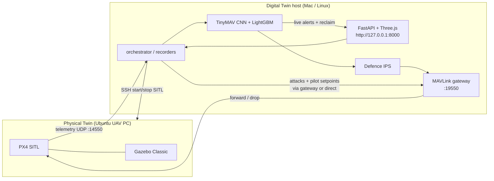

<div align="center">

# UAV Cyber Digital Twin

### MAVLink Attacks · AI Intrusion Detection · Closed-Loop Defence

A research cyber-range coupling a **Physical Twin** (PX4 + Gazebo SITL) with a **Cyber Digital Twin** (FastAPI + Three.js) for attack injection, aligned datasets, AI IDS, and proactive / reactive / hybrid defence.

[](#prerequisites)
[](#architecture-overview)
[](#architecture-overview)
[](#running-the-dashboard)
[](#prerequisites)
[](LICENSE)

[Features](#features) ·
[Architecture](#architecture-overview) ·
[Quick Start](#quick-start) ·
[Attacks](#attack-scenarios) ·
[Defence](#defence-modes) ·
[Docs](#technical-manual) ·
[Troubleshooting](#troubleshooting)

</div>

---

## Table of contents

1. [⚡ TL;DR — clone to flying twin](#tldr)
2. [Features / research contributions](#features)
3. [Architecture overview](#architecture-overview)
4. [Repository layout](#repository-layout)
5. [Repository contents and data release](#repository-contents)
6. [Prerequisites](#prerequisites)
7. [Quick start (beginner path)](#quick-start)
8. [Configuration](#configuration)
9. [Running the dashboard](#running-the-dashboard)
10. [Dataset generation workflow](#dataset-generation)
11. [Training the IDS](#training-the-ids)
12. [Attack scenarios](#attack-scenarios)
13. [Defence modes](#defence-modes)
14. [Technical manual](#technical-manual)
15. [Research use cases](#research-use-cases)
16. [Troubleshooting](#troubleshooting)
17. [Citation / license](#citation--license)
18. [Acknowledgements](#acknowledgements)

---

A research cyber-range that couples a **Physical Twin (PT)** — PX4 Autopilot + Gazebo SITL on an Ubuntu UAV workstation — with a **Cyber Digital Twin (DT)** — FastAPI + Three.js dashboard on a Mac or Linux host. From the DT you fly a shared multi-waypoint mission, inject **MAVLink cyber–physical attacks**, record **aligned physical and network datasets**, train a lightweight **AI intrusion detection system** (TinyMAV 1D-CNN + LightGBM cascade), and evaluate **proactive / reactive / hybrid** defence through a local MAVLink gateway.

MAVLink (via **pymavlink**) is the operational control and telemetry path. **ROS 2 is optional and educational** (see the technical manual Phase 1); it is **not required** to run DT scenarios, dataset collection, IDS, or defence.

---

<a id="tldr"></a>
## ⚡ TL;DR — from clone to a flying twin

You need **two machines on the same LAN**: an Ubuntu **UAV PC** (the Physical
Twin, runs PX4 + Gazebo) and a Mac/Linux **laptop** (the Digital Twin, runs the
dashboard). Full detail in [Quick start](#quick-start); this is the short path.

**On the UAV PC — once.** Install PX4, then the PT scripts (without these,
"Start sim" has nothing to run):

```bash
git clone https://github.com/PX4/PX4-Autopilot.git --recursive ~/PX4-Autopilot
cd ~/PX4-Autopilot && bash ./Tools/setup/ubuntu.sh && make px4_sitl gazebo-classic
sudo apt install openssh-server
```

```bash
git clone https://github.com/danishwasan/UAV-Cyber-Digital-Twin-with-Offensive-and-Defensive-Security-using-AI.git
mkdir -p ~/uav_cyber_testbed
cp -r UAV-Cyber-Digital-Twin-with-Offensive-and-Defensive-Security-using-AI/uav-cyber-ml/pt-setup/{scripts,config} ~/uav_cyber_testbed/
chmod +x ~/uav_cyber_testbed/scripts/*.sh
hostname -I | awk '{print $1}'      # ← note this address
```

**On the laptop (DT).** Clone, install, enable key-based SSH — the project uses
`BatchMode`, so passwords will not work:

```bash
git clone https://github.com/danishwasan/UAV-Cyber-Digital-Twin-with-Offensive-and-Defensive-Security-using-AI.git
cd UAV-Cyber-Digital-Twin-with-Offensive-and-Defensive-Security-using-AI/uav-cyber-ml
python3 -m venv .venv && source .venv/bin/activate
pip install -r requirements.txt
ssh-copy-id <user>@<PT-ip>
```

**Check the link, then fly.** Close QGroundControl first — it holds UDP 14550:

```bash
export UAV_HOST=<PT-ip>
export UAV_SSH_USER=<user>
python scripts/uav_link.py          # all six checks must pass
./run_dashboard.sh                  # → http://127.0.0.1:8000
```

In the browser: **Start sim** (Gazebo appears on the UAV PC), then run
**benign**. Altitude rises, the trail follows the plan, and a run appears under
`datasets/runs/benign/run_00/`.

> **On DHCP?** No extra configuration needed. The PT learns the DT's address
> from the SSH connection that starts SITL, so telemetry follows your laptop
> wherever DHCP puts it. If the PT's own address changes, re-run `uav_link.py`
> (or use `UAV_HOST=<pt-hostname>.local`). See
> [Network setup](#configuration).

**Nothing moving?** Run `python scripts/uav_link.py` — it names the failing
piece. The usual causes are a wrong `UAV_HOST`, missing SSH keys, or
QGroundControl holding port 14550.

---

<a id="features"></a>
## ✨ Features / research contributions

- **Synchronised PT ↔ DT loop** — live 3D twin, HUD, trails, and graphs driven by real PX4 telemetry (`:14550`), while Gazebo on the UAV PC remains the physical visualisation.
- **Shared-mission protocol** — every scenario (benign and attack) flies the same multi-waypoint OFFBOARD plan so pre/post windows are comparable; only the attack window is labeled as attack.
- **Two-layer labeled datasets** — physical (flight state) and network (MAVLink traffic), each in raw + processed form, with run metadata and a data dictionary.
- **Attack taxonomy** — Tier A core case studies + Tier B supporting classes (see [CASE_STUDIES.md](uav-cyber-ml/CASE_STUDIES.md)).
- **AI IDS** — primary **TinyMAV 1D-CNN** (`cnn1d`) with optional **LightGBM** physical / network / fusion cascade; live scoring in the dashboard.
- **Closed-loop defence** — Mac-local MAVLink **gateway** (`:19550`) for pre-PX4 drops (**proactive**), post-detect reclaim (**reactive**), or both (**hybrid**).
- **End-to-end orchestration** — SSH start/stop of SITL, one-click dashboard scenarios, or CLI matrix runs via `orchestrator.py`.

---

<a id="architecture-overview"></a>
## 🏗 Architecture overview



**Typical lab addressing** (overridable via env / `config.py`):

| Role | Default |
|------|---------|
| UAV / PT host | `192.168.123.130` |
| SSH user | `danish` |
| Telemetry / GCS broadcast | UDP **14550** |
| Proactive MAVLink gateway (DT-local) | UDP **19550** → UAV `:14550` |
| Legacy GCS API peer | UDP **18570** |
| Dashboard | `http://127.0.0.1:8000` |

```
DT host ──ssh──► start/stop PX4+Gazebo on PT
DT recorder ◄── MAVLink :14550 ── physical features + live twin
DT tcpdump  ◄── DT⇄PT packets ── network features
DT attacks  ──► gateway :19550 ──► PX4 :14550   (or direct if MAV_GATEWAY=0)
IDS + IPS   ──► drop at gateway and/or reclaim control
```

---

<a id="repository-layout"></a>
## 📁 Repository layout

**All Python code lives in the `uav-cyber-ml/` subdirectory.** Run every command
below from inside that folder, not from the repository root.

```
<repo root>/
├── README.md                 # this file (canonical project README)
├── Manual.pdf                # technical manual (prebuilt PDF)
└── uav-cyber-ml/             # ← the runnable project; cd here first
    ├── CASE_STUDIES.md       # attack hypotheses, P/N/T effects, defence mapping
    ├── requirements.txt
    ├── run_dashboard.sh      # launch dashboard (primes sudo for tcpdump)
    ├── config.py             # hosts, ports, mission plan, IDS/defence defaults
    ├── orchestrator.py       # CLI master runner: SITL, record, attack, label
    ├── ssh_control.py        # passwordless SSH start/stop/monitor of PX4 SITL
    ├── mav_common.py         # shared pymavlink GCS helpers, vehicle state, abort
    ├── build_dataset.py      # merge datasets/runs/ → labeled CSVs + dictionary
    ├── attacks/              # benign pilot + attack suite
    │   ├── __init__.py
    │   ├── benign.py         # BenignPilot: shared mission, attack gates
    │   └── suite.py          # Tier A / Tier B attack registry
    ├── recorders/
    │   ├── physical_recorder.py
    │   ├── network_recorder.py
    │   ├── twin_bridge.py
    │   └── live_network.py
    ├── dashboard/            # FastAPI + Three.js digital twin UI
    │   ├── server.py
    │   ├── datasets.py
    │   └── static/           # index.html, app.js, app.css
    ├── ids/                  # TinyMAV CNN + LightGBM cascade, gateway, defence
    │   ├── __main__.py       # python -m ids
    │   ├── train.py / cnn_*.py
    │   ├── mav_gateway.py / defense.py / live_*.py
    │   └── artifacts/        # cnn_mav1d.pt, *.joblib, metrics (regenerable)
    ├── datasets/             # see datasets/README.md
    │   ├── DATA_DICTIONARY.md
    │   └── runs/             # populated by the orchestrator / dashboard
    ├── scripts/
    │   ├── uav_link.py       # preflight: check the DT → PT network link
    │   └── enable_network_capture.sh
    └── Doc/
        └── Manual.pdf        # same technical manual, alongside the code
```

> **Documentation in this release.** The technical manual ships as a prebuilt
> **`Manual.pdf`** (repo root and `uav-cyber-ml/Doc/`). The LaTeX sources
> (`main.tex`, `chapters/`, `figures/`, `references.bib`) and the `papers/`
> drafts are **not** part of this public release — they are kept in the authors'
> private tree. Nothing in the runnable stack depends on them.

<details>
<summary><strong>Path → purpose quick reference</strong></summary>

Paths are relative to `uav-cyber-ml/`.

| Path | Purpose |
|------|---------|
| `config.py` | Hosts, ports, mission plan, timing, IDS/defence defaults |
| `orchestrator.py` | CLI master runner: SITL, record, attack, label |
| `ssh_control.py` | Passwordless SSH start/stop/monitor of PX4 SITL |
| `mav_common.py` | Shared pymavlink GCS helpers, vehicle state, abort |
| `build_dataset.py` | Merge `datasets/runs/` → labeled CSVs + data dictionary |
| `attacks/` | Benign pilot + attack suite (`suite.py`, `benign.py`) |
| `recorders/` | Physical + network recorders, twin bridge, live network |
| `dashboard/` | FastAPI app + Three.js static UI (`dashboard/static/`) |
| `ids/` | Training, TinyMAV CNN, LightGBM, live bridge, gateway, defence |
| `ids/artifacts/` | Trained models and metrics (regenerable) |
| `datasets/` | Per-run recordings and merged matrices — see [datasets/README.md](uav-cyber-ml/datasets/README.md) |
| `scripts/enable_network_capture.sh` | Helper to enable network-layer capture |
| `run_dashboard.sh` | Launch dashboard (primes `sudo` for tcpdump) |
| `CASE_STUDIES.md` | Hypotheses, P/N/T effects, defence mapping |
| `Doc/Manual.pdf` | Full technical manual (prebuilt PDF; also at the repo root) |
| `requirements.txt` | Python dependencies |

</details>

---

<a id="repository-contents"></a>
## 📦 Repository contents and data release

The public tree is intended to ship **source, documentation, and small reproducibility artefacts**. Large raw captures and secrets are excluded via `.gitignore` and should be published separately (e.g. Zenodo or GitHub Releases) when sharing datasets.

<details>
<summary><strong>What ships in-repo vs external archives</strong> (click to expand)</summary>

### In-repository (source and docs)

- Application and experiment code: `dashboard/`, `attacks/`, `ids/*.py`, `recorders/`, `scripts/`, `orchestrator.py`, `ssh_control.py`, `mav_common.py`, `build_dataset.py`, `config.py`, `run_dashboard.sh`
- `requirements.txt`, `README.md`, `CASE_STUDIES.md`, `.gitignore`
- Technical manual as a prebuilt PDF: `Manual.pdf` (repo root) and `uav-cyber-ml/Doc/Manual.pdf`. LaTeX sources and `papers/` drafts are not in this release.
- Dataset documentation: `datasets/DATA_DICTIONARY.md`, `datasets/README.md`, `datasets/runs/.gitkeep`
- IDS artefacts: TinyMAV weights `ids/artifacts/cnn_mav1d.pt` (~40 KB) plus metadata, and the LightGBM `*.joblib` bundles (~8 MB total), so live scoring and defence work on a fresh clone without retraining

> **⚠️ No dataset CSVs ship with this release.** `datasets/runs/` is empty and the
> merged `*_processed_dataset.csv` matrices are not committed, so
> **`python -m ids` cannot retrain on a fresh clone** — it exits with
> `FileNotFoundError: … datasets/physical_processed_dataset.csv`.
> This is expected. Either use the pretrained artefacts already in
> `ids/artifacts/`, or generate your own data first
> (`python orchestrator.py --scope core --runs 5` → `python build_dataset.py`),
> which requires a working PX4 SITL Physical Twin. See
> [Dataset generation](#dataset-generation).

### Excluded or archived externally (see `.gitignore`)

| Path / pattern | Rationale |
|----------------|-----------|
| `.venv/`, `__pycache__/`, `*.pyc` | Local install artefacts |
| `.env`, SSH private keys, `*.pem` | Secrets |
| `datasets/*_raw_dataset.csv` | Large merged raw matrices (~150–220 MB each) |
| `datasets/runs/**/*.pcap`, `*_raw.csv` | Per-run captures (~10–200 MB/scenario) |
| Full `datasets/runs/` tree | Prefer empty tree + regeneration, or a minimal sample |
| `ids/artifacts/history/`, `fused_1s_dataset.csv` | Regenerable training scratch |
| OS / editor noise (e.g. `.DS_Store`) | Non-reproducible clutter |

### Typical artefact sizes (lab reference)

| Path | Approx. size | Release guidance |
|------|--------------|------------------|
| `datasets/` (full lab tree) | ~1.1 GB | Prefer external archive, not wholesale VCS |
| `datasets/physical_raw_dataset.csv` | ~153 MB | External archive |
| `datasets/network_raw_dataset.csv` | ~218 MB | External archive |
| `datasets/physical_processed_dataset.csv` | ~27 MB | Optional in-repo or release asset |
| `datasets/network_processed_dataset.csv` | ~276 KB | Suitable in-repo sample |
| `datasets/runs/` | ~760 MB | Minimal sample or regenerate |
| `ids/artifacts/` | ~11 MB | CNN weights recommended; joblibs optional |
| `Manual.pdf` | ~5 MB | Shipped in-repo (root + `uav-cyber-ml/Doc/`) |

</details>

---

<a id="prerequisites"></a>
## 🔧 Prerequisites

### Hardware / topology

| Setup | Notes |
|-------|--------|
| **Two PCs (lab default)** | Ubuntu UAV PC = PT (PX4 + Gazebo). Mac or Linux laptop = DT (dashboard, attacks, IDS). Same L2/L3 lab LAN. |
| **One advanced host** | Possible if Ubuntu runs SITL *and* the Python DT stack; still treat ports and SSH as if split. |

### Software

**Physical Twin (Ubuntu)**

- PX4 Autopilot SITL + Gazebo Classic (lab scripts under `~/uav_cyber_testbed` by default — see `config.TESTBED_DIR`)
- SSH server; passwordless key auth from the DT host
- Optional: ROS 2 for educational PT tooling only

**Digital Twin host (macOS or Linux)**

- Python **3.11+** recommended
- `tcpdump` + ability to `sudo` (network layer capture)
- Free UDP **14550** during collection (close QGroundControl or rebind it)
- Browser for `http://127.0.0.1:8000`

---

<a id="quick-start"></a>
## 🚀 Quick start (beginner path) — first benign mission

Numbered path to a first successful **benign** flight with live DT visualisation.

1. **Clone and enter the project directory**

   The code lives in the `uav-cyber-ml/` subfolder — you must `cd` into it, or
   Python will not find the `attacks`, `ids`, and `dashboard` packages.

   ```bash
   git clone https://github.com/<your-user>/UAV-Cyber-Digital-Twin-with-Offensive-and-Defensive-Security-using-AI.git
   cd UAV-Cyber-Digital-Twin-with-Offensive-and-Defensive-Security-using-AI/uav-cyber-ml
   ```

2. **Create a virtualenv and install dependencies**
   ```bash
   python3 -m venv .venv
   source .venv/bin/activate   # Windows: .venv\Scripts\activate
   pip install -r requirements.txt
   ```

3. **Confirm SSH to the Physical Twin** (defaults; change if needed)
   ```bash
   ssh danish@192.168.123.130 echo ok
   # or: UAV_HOST=… UAV_SSH_USER=… ssh "$UAV_SSH_USER@$UAV_HOST" echo ok
   ```

4. **Close QGroundControl** (or move it off UDP 14550) so the physical recorder can bind telemetry.

5. **Launch the digital-twin dashboard**
   ```bash
   ./run_dashboard.sh
   # open http://127.0.0.1:8000
   ```
   Enter your Mac/Linux password once if prompted so `tcpdump` can capture (skippable: physical-only still works).

6. **Start SITL** from the UI (`Start sim` / PT controls) — Gazebo should appear on the UAV display; the 3D twin should receive telemetry.

7. **Run `benign`** with Mission profile. Watch altitude rise, trail follow the shared plan, and a new folder appear under `datasets/runs/benign/run_NN/`.

8. **Stop** when finished. Optionally build merged CSVs later with `python build_dataset.py`.

> **💡 Beginner tip:** If the twin stays on the ground, check SSH reachability and that Gazebo/`gzclient` is running on the UAV PC before debugging IDS or attacks.

---

<a id="configuration"></a>
## ⚙️ Configuration

Central file: [`config.py`](uav-cyber-ml/config.py). Prefer **environment variables** for lab-specific values so you never commit secrets.

### 🌐 Network setup: connecting the DT to the PT (read this first)

The defaults below (`192.168.123.130`, user `danish`) are the **authors' bench**,
where the UAV workstation holds a **static** address. On a normal DHCP network
your Physical Twin has a **different address**, often a new one after each
reboot — so the defaults will not reach it. This is the most common setup
problem, and it needs **no code changes**: everything is environment variables.

**Step 1 — find your PT's address.** On the **UAV PC**, run:

```bash
hostname -I | awk '{print $1}'      # e.g. 192.168.1.42
whoami                              # your SSH user
```

**Step 2 — check the link from the DT.** On the **Digital Twin host**:

```bash
python scripts/uav_link.py --host 192.168.1.42 --user pilot
```

This checks DNS, ping, the SSH port, key-based SSH login, whether UDP 14550 is
free, and which interface tcpdump should capture on — then prints the exact
`export` lines to use. If you don't know the address, `python scripts/uav_link.py --scan`
lists hosts on your subnet with SSH open.

**Step 3 — export and launch:**

```bash
export UAV_HOST=192.168.1.42
export UAV_SSH_USER=pilot
./run_dashboard.sh
```

Put those `export` lines in your shell profile (`~/.zshrc`, `~/.bashrc`) to make
them persistent.

<details>
<summary><strong>Surviving DHCP address changes</strong> (recommended)</summary>

Rather than chasing a new IP after every reboot, point `UAV_HOST` at the PT's
**mDNS hostname**, which stays stable:

```bash
# On the UAV PC (Ubuntu) — usually already installed:
sudo apt install avahi-daemon
hostname                            # e.g. uav-station

# On the DT host — verify it resolves, then use it:
ping uav-station.local
export UAV_HOST=uav-station.local
```

`config.py` resolves the name to an IP once at startup, because the network
recorder compares captured packet addresses against `UAV_HOST` to label
direction — a bare hostname would silently mislabel every packet rather than
fail loudly.

The most robust option, if you control the router, is a **DHCP reservation**
(static lease) that always hands the PT the same address. Then use that IP.

</details>

| Symptom | Fix |
|---------|-----|
| `Physical Twin unreachable` | Wrong `UAV_HOST`/`UAV_SSH_USER`, or no SSH key. Run `python scripts/uav_link.py`. |
| SSH prompts for a password | The project uses `BatchMode` (keys only). Run `ssh-copy-id <user>@<host>`. |
| Network CSV/pcap empty | Wrong capture interface. `uav_link.py` reports the right one; set `NET_IFACE`. |
| PT and DT on different subnets | They must share a LAN. Check both with `hostname -I`; Wi-Fi client isolation also blocks this. |

| Variable | Default | Meaning |
|----------|---------|---------|
| `UAV_HOST` | `192.168.123.130` | Physical Twin IP **or hostname** (e.g. `uav.local`; resolved at startup) |
| `UAV_SSH_USER` | `danish` | SSH user |
| `MAV_GATEWAY` | `1` | `0`/`false`/`off` = bypass gateway (direct to PX4; reactive-only) |
| `MAV_GATEWAY_PORT` | `19550` | Local gateway listen port |
| `MAV_GATEWAY_HOST` | `127.0.0.1` | Gateway bind host |
| `NET_IFACE` | auto-detected | tcpdump interface toward UAV (`route get` on macOS, `ip route get` on Linux) |
| `FLIGHT_PROFILE` | `mission` | `mission` \| `hover` |
| `DEFENSE_MODE` | `proactive` | `proactive` \| `reactive` \| `hybrid` \| `prevent` \| `soft` |
| `IDS_PRIMARY_MODEL` | `cnn1d` | `cnn1d` (TinyMAV) or `fusion` (LightGBM cascade) |
| `DEFENSE_ENGAGE_SCORE` | `0.72` | Score threshold to engage IPS |
| `DEFENSE_TRUST_MODEL` | `1` | Allow high-confidence engage outside GT windows |
| `GPS_SPOOF_DRIFT` | `3e-5` | GPS spoof severity (deg/s) |
| `PIPELINE_SCOPE` | `core` | `core` \| `all` \| … |
| `PIPELINE_RUNS` | `10` | Suggested runs/scenario for papers |
| `RUN_DURATION_S`, `ATTACK_AT_S`, `WARMUP_S`, `ATTACK_DUR_S`, … | derived from mission | Timing overrides |
| `ATTACK_AFTER_WP` | `4` | First eligible attack gate (0-based WP index) |
| `ATTACK_GATE_FRACTION` | `0.5` | Fraction of mid-mission WPs used as attack gates |
| `PORT` | `8000` | Dashboard port (`run_dashboard.sh`) |

**SSH keys:** use a normal user keypair with `BatchMode` access to the UAV. Never commit private keys. `ssh_control.py` uses `ssh -o BatchMode=yes`.

---

<a id="running-the-dashboard"></a>
## 🖥 Running the dashboard

```bash
./run_dashboard.sh
# equivalent:
# PORT=8000 .venv/bin/python -m uvicorn dashboard.server:app --host 127.0.0.1 --port 8000
```

Open **http://127.0.0.1:8000**.

What you get:

- **3D digital twin** — pose, altitude, armed/mode, trail, mini-map
- **Scenario controls** — benign + attacks; Mission/Hover; network capture toggle
- **Live graphs** — physical and network rates; attack banner during injection
- **Live IDS** — toggle in the top bar; alerts on twin / HUD / score chart / log
- **Defence** — arm only when trained artefacts are loaded; choose mode in UI/API
- **Dataset explorer** — browse saved raw/processed CSVs with attack windows shaded
- **Run log** — orchestrator / pilot / attack / IDS messages over WebSocket

Dashboard runs write the same per-run layout as the CLI (`datasets/runs/<scenario>/run_NN/`).

---

<a id="dataset-generation"></a>
## 📊 Dataset generation workflow

### CLI

```bash
# List scenarios
.venv/bin/python orchestrator.py --list

# Core research matrix (benign + Tier A), N runs each
.venv/bin/python orchestrator.py --scope core --runs 5

# Physical only (no tcpdump)
.venv/bin/python orchestrator.py --scope core --runs 5 --no-network

# Explicit subset / quick smoke test
RUN_DURATION_S=22 ATTACK_AT_S=9 .venv/bin/python orchestrator.py \
  --scenarios benign,disarm_injection --runs 1

# Include Tier B
.venv/bin/python orchestrator.py --scope all --runs 1
```

Each run: restart SITL → record → shared mission (benign or warmup + attack gates) → stop → write:

`physical_raw.csv`, `physical_processed.csv`, `network_raw.csv`, `network_processed.csv`, optional `network_capture.pcap`, `metadata.json`.

### Merge for ML

```bash
.venv/bin/python build_dataset.py
```

Outputs under `datasets/`:

- `physical_raw_dataset.csv` / `physical_processed_dataset.csv`
- `network_raw_dataset.csv` / `network_processed_dataset.csv`
- `DATA_DICTIONARY.md`

Details: [datasets/README.md](uav-cyber-ml/datasets/README.md), [datasets/DATA_DICTIONARY.md](uav-cyber-ml/datasets/DATA_DICTIONARY.md).

> **🔬 Advanced note:** Prefer run-wise train/test splits (as `ids.train` does). Do not randomly shuffle rows across time within a run if you care about leakage.

---

<a id="training-the-ids"></a>
## 🧠 Training the IDS

> **Prerequisite:** training reads `datasets/physical_processed_dataset.csv` and
> `datasets/network_processed_dataset.csv`. **Neither ships with the repo**, so
> you must run [dataset generation](#dataset-generation) first (which needs a
> live PX4 SITL Physical Twin). Pretrained artefacts are already in
> `ids/artifacts/` if you only want to run live scoring and defence.

Train LightGBM cascade **and** TinyMAV 1D-CNN from processed datasets:

```bash
.venv/bin/python -m ids                 # train → ids/artifacts/
.venv/bin/python -m ids cnn             # CNN-only path
.venv/bin/python -m ids score --limit 300   # offline replay
```

Artefacts include per-modality models (`physical`, `network`, `fusion`), `cnn_mav1d.pt`, metrics JSON, and feature lists.

**Primary model** defaults to TinyMAV (`IDS_PRIMARY_MODEL=cnn1d`). Set `IDS_PRIMARY_MODEL=fusion` to prefer the LightGBM cascade for live detect/defend.

Live training / reload is also available from the dashboard (`/api/train`) when you collect new runs.

---

<a id="attack-scenarios"></a>
## ⚔️ Attack scenarios

See [CASE_STUDIES.md](uav-cyber-ml/CASE_STUDIES.md) for hypotheses and P/N/T (Physical / Network / Twin) effects.

> All scenarios below have been run end-to-end against a live PX4 + Gazebo
> Physical Twin and confirmed to fly, inject, and label. The
> [Verified on hardware](uav-cyber-ml/CASE_STUDIES.md#verified-on-hardware)
> table records exactly what each one injects and the effect observed — read it
> before relying on a scenario, especially the `rc_override` note (no physical
> effect under OFFBOARD) and the network-dominant cases (`command_flood_dos`,
> `param_injection`, `heartbeat_spoof`), which need network capture on to show
> their signature.

Run your first attack (a full flight, dataset written to `datasets/runs/gps_spoofing/`):

```bash
python orchestrator.py --scenarios gps_spoofing --runs 1
```

<details open>
<summary><strong>Tier A — core pipeline</strong> (<code>--scope core</code>)</summary>

| ID | Brief |
|----|--------|
| `benign` | Shared multi-waypoint OFFBOARD mission (negative class) |
| `gps_spoofing` | Drifting `GPS_INPUT` bias mid-mission |
| `disarm_injection` | Force-DISARM in flight (motors cut) |
| `mode_change_land` | Hijack to `AUTO.LAND` |
| `mission_injection` | Rogue mission upload + `AUTO.MISSION` |
| `command_flood_dos` | Flood `COMMAND_LONG` + heartbeats |
| `rc_override` | Stick hijack via `MANUAL_CONTROL` |
| `param_injection` | Malicious `PARAM_SET` on failsafe-related params |

</details>

<details>
<summary><strong>Tier B — supporting</strong> (<code>--scope all</code>)</summary>

| ID | Brief |
|----|--------|
| `mode_change_rtl` | Mode hijack to `AUTO.RTL` |
| `heartbeat_spoof` | Conflicting GCS heartbeats (strong N, weak P) |
| `takeoff_injection` | Unauthorized arm + `AUTO.TAKEOFF` |

</details>

---

<a id="defence-modes"></a>
## 🛡 Defence modes

Configured by `DEFENSE_MODE` (env / `config.py` / dashboard API). Defence engages only when a **trained model is loaded** and the operator enables Defence.

| Mode | Behaviour | When to use |
|------|-----------|-------------|
| **proactive** | Gateway drops dangerous attacker MAVLink/GPS **before** PX4; default lab mode | Measure pre-UAV prevention; minimise physical effect |
| **reactive** | Forward all traffic; IDS detects then **reclaim** (abort injector, OFFBOARD hold, re-arm/mode restore) | Study detect → recover latency and residual damage |
| **hybrid** (alias **prevent**) | Proactive drops **plus** reactive reclaim fallback | Recommended closed-loop defence evaluation |
| **soft** | Short reactive reclaim only | Mild recover without long prevent hold |

Supporting knobs: `DEFENSE_SIGNATURE_GRACE_S` (brief window so IDS still sees a signature), `DEFENSE_PREVENT_HOLD_S`, `DEFENSE_ENGAGE_SCORE`, `DEFENSE_TRUST_MODEL`.

```bash
# Example: hybrid defence with CNN primary
DEFENSE_MODE=hybrid IDS_PRIMARY_MODEL=cnn1d ./run_dashboard.sh

# Bypass gateway entirely (direct udpout; reactive-only path)
MAV_GATEWAY=0 DEFENSE_MODE=reactive ./run_dashboard.sh
```

Detection-only: leave Defence unchecked — IDS alerts without touching the vehicle.

---

<a id="technical-manual"></a>
## 📚 Technical manual

The manual ships as a **prebuilt PDF** in two places (identical file):

| Path | Notes |
|------|-------|
| `Manual.pdf` | Repository root — easiest to find on GitHub |
| `uav-cyber-ml/Doc/Manual.pdf` | Alongside the code |

```bash
open Manual.pdf            # macOS
# xdg-open Manual.pdf      # Linux
```

**Phases:** (1) Ubuntu UAV workstation — PX4, Gazebo, optional ROS 2; (2) Operational DT — dashboard, recorders, scenarios; (3) TinyMAV + LightGBM, proactive/hybrid/reactive defence.

> The LaTeX sources for the manual are not part of this public release, so there
> is nothing to compile — read the PDF directly.

---

<a id="research-use-cases"></a>
## 🔬 Research use cases / suggested experiments

1. **Baseline fingerprints** — ≥10 benign runs; report physical stability and network baselines on the shared plan.
2. **Tier A matrix** — `orchestrator.py --scope core --runs 10`; build dataset; train IDS; report precision/recall/F1/FPR and mean detection delay.
3. **Defence ablation** — same attack set under `proactive` vs `reactive` vs `hybrid`; compare proactive block counts, mitigation delay, mission resume success (`datasets/paper_live_metrics.json` / dashboard metrics).
4. **GPS severity ladder** — vary `GPS_SPOOF_DRIFT` (`3e-6` / `1e-5` / `5e-5`); measure path error and DT–PT residual.
5. **Modality study** — physical-only vs network-only vs fusion vs `cnn1d` primary.
6. **Gateway off** — `MAV_GATEWAY=0` to quantify sticky-peer / reclaim-only behaviour.
7. **Tier B appendix** — heartbeat spoof and takeoff for multiclass / phase-aware papers.
8. **Extension ideas** — telemetry FDI, replay/delay, selective drop, combined GPS+DoS (Tier C in CASE_STUDIES — not implemented yet).

---

<a id="troubleshooting"></a>
## 🩹 Troubleshooting

| Symptom | Likely cause / fix |
|---------|-------------------|
| `ModuleNotFoundError: No module named 'attacks'` (also `ids`, `dashboard`, `config`) | You are in the wrong directory. All packages are inside `uav-cyber-ml/` — run `cd uav-cyber-ml` first. Every command in this README assumes that working directory. |
| `FileNotFoundError: … datasets/physical_processed_dataset.csv` on `python -m ids` | Expected: no dataset CSVs ship with the repo. Use the pretrained models already in `ids/artifacts/`, or record your own runs first (`python orchestrator.py --scope core --runs 5` then `python build_dataset.py`). |
| `./run_dashboard.sh: permission denied` | Make it executable: `chmod +x run_dashboard.sh`. (Fixed in-repo; only affects clones made before that fix.) |
| `env: bash\r: No such file or directory` | The script has Windows CRLF line endings. Fix with `perl -i -pe 's/\r$//' run_dashboard.sh`, or just run `bash run_dashboard.sh`. (Fixed in-repo; a `.gitattributes` now pins `*.sh` to LF.) |
| `.venv/bin/python: No such file or directory` | `run_dashboard.sh` expects the virtualenv at `uav-cyber-ml/.venv`. Create it there (step 2 of [Quick start](#quick-start)), or launch directly: `python -m uvicorn dashboard.server:app --host 127.0.0.1 --port 8000`. |
| SSH / “Physical Twin unreachable” | Wrong LAN, host down, or key auth. Check `UAV_HOST` / `UAV_SSH_USER`. |
| Twin frozen / no telemetry | Port **14550** held by QGroundControl; close it or rebind. Confirm SITL is up. |
| No Gazebo window on UAV | `gzserver` without `gzclient` — dashboard Start sim / `ssh_control.ensure_gzclient` should start GUI on `DISPLAY=:0`. |
| Network CSV / pcap empty | `sudo` not primed; use `./run_dashboard.sh` or CLI password prompt; or run with `--no-network`. |
| tcpdump on wrong iface | Set `NET_IFACE=en0` (or your LAN NIC). |
| Attacks do nothing | Gateway/defence dropping early; try `DEFENSE_MODE=reactive` with Defence off for clean labels. Verify attacker reaches PX4. |
| Defence stays OFF | No trained artefacts — run `python -m ids` or dashboard Train; Defence requires `model_available`. |
| IDS never loads CNN | Missing `ids/artifacts/cnn_mav1d.pt` — train with `python -m ids` / `python -m ids cnn`. |
| Permission errors on capture | Grant tcpdump/`sudo` or disable network capture. |
| Import / torch install issues | Use the project `.venv`; on Apple Silicon prefer official PyTorch wheels matching your Python. |

---

<a id="citation--license"></a>
## 📄 Citation / license

The associated research article is **in preparation / forthcoming** and has not yet been published. A formal citation (BibTeX / APA) will be added here once the paper is available. In the meantime, if you use this software or dataset, please cite this repository and optionally contact the authors for the preferred citation. Please also acknowledge the PX4, Gazebo, MAVLink, and pymavlink communities.

**License:** [MIT](LICENSE) © 2026 Danish Vasan. You may use, modify, and
redistribute this software, including commercially, provided the copyright
notice and licence text are retained. The software is provided "as is", without
warranty of any kind.

> **Scope note.** The MIT licence covers the **software in this repository**.
> Datasets generated with it, and the technical manual (`Manual.pdf`), are not
> covered by it — if you publish those separately, state their terms explicitly
> (a data licence such as CC BY 4.0 is common for research datasets).

---

<a id="acknowledgements"></a>
## 🙏 Acknowledgements

- [PX4 Autopilot](https://px4.io/) and Gazebo Classic SITL ecosystem  
- [MAVLink](https://mavlink.io/) / [pymavlink](https://github.com/ArduPilot/pymavlink)  
- FastAPI, Uvicorn, Three.js, PyTorch, LightGBM, scikit-learn, pandas, scapy, Paramiko  
- Lab operators and students who validated live attack and defence scenarios  

For case-study hypotheses and defence mapping, start with [CASE_STUDIES.md](uav-cyber-ml/CASE_STUDIES.md). For step-by-step PT provisioning and deeper architecture, read the [technical manual](Manual.pdf).
